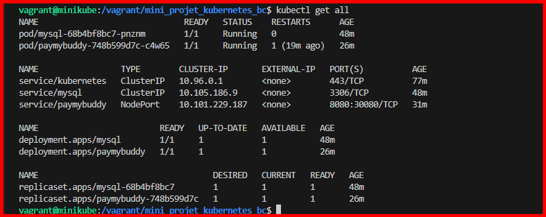
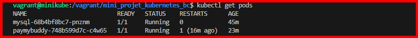
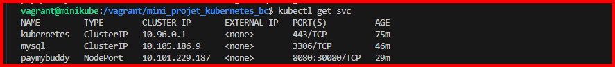
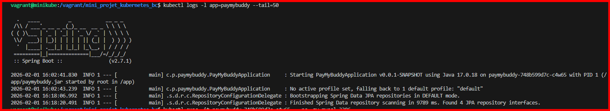

# PayMyBuddy - Déploiement Kubernetes

Déploiement de l'application PayMyBuddy sur Kubernetes avec manifests YAML (sans Helm).

## Prérequis

- Cluster Kubernetes opérationnel (Minikube, Kind, K3s, ou cluster cloud)
- kubectl configuré et connecté au cluster
- Application PayMyBuddy : https://github.com/eazytraining/PayMyBuddy/tree/main/

## Architecture

```
┌─────────────────┐      ┌──────────────────┐
│   NodePort      │      │   ClusterIP      │
│  paymybuddy:    │─────▶│    mysql:3306    │
│    30080        │      │                  │
└─────────────────┘      └──────────────────┘
        │                         │
        ▼                         ▼
┌─────────────────┐      ┌──────────────────┐
│  Deployment     │      │  Deployment      │
│  paymybuddy     │      │    mysql         │
│  (2 replicas)   │      │  (1 replica)     │
└─────────────────┘      └──────────────────┘
        │
        ▼
┌─────────────────┐
│ PersistentVolume│
│  /data/paymybuddy│
│  (hostPath)     │
└─────────────────┘
```

## Déploiement

### Ordre de déploiement (important !)

```bash
# 1. Déployer le volume persistant
kubectl apply -f paymybuddy-pv.yaml
kubectl apply -f paymybuddy-pvc.yaml

# 2. Déployer MySQL (base de données)
kubectl apply -f mysql-deployment.yaml
kubectl apply -f mysql-service.yaml

# Attendre que MySQL soit prêt (important !)
kubectl wait --for=condition=ready pod -l app=mysql --timeout=120s

# 3. Déployer PayMyBuddy (application)
kubectl apply -f paymybuddy-deployment.yaml
kubectl apply -f paymybuddy-service.yaml
```

### Déploiement tout-en-un

```bash
# Appliquer tous les manifests d'un coup
kubectl apply -f .

# Vérifier le statut
kubectl get all
```

## ✅ Vérifications

### Vérifier les pods

```bash
kubectl get pods
# Sortie attendue :
# NAME                           READY   STATUS    RESTARTS   AGE
# mysql-xxxxxxxxx-xxxxx          1/1     Running   0          2m
# paymybuddy-xxxxxxxxx-xxxxx     1/1     Running   0          1m
# paymybuddy-xxxxxxxxx-yyyyy     1/1     Running   0          1m
```

### Vérifier les services

```bash
kubectl get svc
# Sortie attendue :
# NAME         TYPE        CLUSTER-IP      EXTERNAL-IP   PORT(S)          AGE
# mysql        ClusterIP   10.96.xxx.xxx   <none>        3306/TCP         2m
# paymybuddy   NodePort    10.96.xxx.xxx   <none>        8080:30080/TCP   1m
```

### Vérifier les volumes

```bash
kubectl get pv,pvc
# Sortie attendue :
# NAME                              CAPACITY   ACCESS MODES   STATUS   CLAIM
# persistentvolume/paymybuddy-pv    5Gi        RWO            Bound    default/paymybuddy-pvc
#
# NAME                                   STATUS   VOLUME           CAPACITY
# persistentvolumeclaim/paymybuddy-pvc   Bound    paymybuddy-pv    5Gi
```

### Vérifier les logs

```bash
# Logs MySQL
kubectl logs -l app=mysql

# Logs PayMyBuddy
kubectl logs -l app=paymybuddy

# Suivre les logs en temps réel
kubectl logs -f -l app=paymybuddy
```

## 🌐 Accès à l'application

### Avec Minikube

```bash
# Obtenir l'URL d'accès
minikube service paymybuddy --url

# Ou ouvrir directement dans le navigateur
minikube service paymybuddy
```

### Avec cluster local (Kind, K3s, Docker Desktop)

```bash
# L'application est accessible sur :
http://localhost:30080
```

### Avec cluster cloud (AKS, EKS, GKE)

```bash
# Obtenir l'IP du node
kubectl get nodes -o wide

# Accéder via :
http://<NODE_IP>:30080
```

## 🔍 Debug et Troubleshooting

### Pods ne démarrent pas

```bash
# Décrire le pod pour voir les événements
kubectl describe pod <pod-name>

# Vérifier les logs d'erreur
kubectl logs <pod-name>
```

### Problème de connexion MySQL

```bash
# Se connecter au pod PayMyBuddy pour tester la connexion
kubectl exec -it <paymybuddy-pod> -- sh

# Dans le pod, tester la connexion MySQL
ping mysql
nc -zv mysql 3306
```

### Volume non monté

```bash
# Sur le node, vérifier que /data existe
ssh <node>
ls -la /data/paymybuddy

# Ou avec Minikube
minikube ssh
ls -la /data/paymybuddy
```

### Erreur "ImagePullBackOff"

```bash
# Vérifier que l'image existe
docker pull eazytraining/paymybuddy:latest

# Ou créer l'image localement si nécessaire
```

## 📊 Monitoring

### Ressources utilisées

```bash
# CPU et Mémoire des pods
kubectl top pods

# CPU et Mémoire des nodes
kubectl top nodes
```

### Health checks

```bash
# Vérifier le readiness endpoint
kubectl get pods -o wide
curl http://<POD_IP>:8080/actuator/health

# Depuis l'extérieur via NodePort
curl http://<NODE_IP>:30080/actuator/health
```

## 🧪 Tests

### Test de haute disponibilité

```bash
# Supprimer un pod PayMyBuddy
kubectl delete pod <paymybuddy-pod-1>

# Kubernetes va automatiquement recréer un nouveau pod
kubectl get pods -w

# L'application reste accessible pendant ce temps
```

### Test de persistance des données

```bash
# Supprimer le deployment PayMyBuddy
kubectl delete deployment paymybuddy

# Recréer le deployment
kubectl apply -f paymybuddy-deployment.yaml

# Les données dans /data sont préservées grâce au PV
```

## 🧹 Nettoyage

### Supprimer les ressources

```bash
# Supprimer tous les manifests
kubectl delete -f .

# Ou supprimer individuellement
kubectl delete -f paymybuddy-service.yaml
kubectl delete -f paymybuddy-deployment.yaml
kubectl delete -f mysql-service.yaml
kubectl delete -f mysql-deployment.yaml
kubectl delete -f paymybuddy-pvc.yaml
kubectl delete -f paymybuddy-pv.yaml
```

### Supprimer les données persistantes

```bash
# Sur le node (ou Minikube)
sudo rm -rf /data/paymybuddy
```

## 📝 Configuration détaillée

### Variables d'environnement PayMyBuddy

| Variable | Valeur | Description |
|----------|--------|-------------|
| SPRING_DATASOURCE_USERNAME | root | User MySQL |
| SPRING_DATASOURCE_PASSWORD | password | Password MySQL |
| SPRING_DATASOURCE_URL | jdbc:mysql://mysql:3306/db_paymybuddy | Connection string (utilise le service DNS Kubernetes) |

### Variables d'environnement MySQL

| Variable | Valeur | Description |
|----------|--------|-------------|
| MYSQL_ROOT_PASSWORD | password | Root password |
| MYSQL_DATABASE | db_paymybuddy | Base de données à créer |

## 🎯 Bonnes pratiques implémentées

✅ **Séparation des responsabilités** : MySQL et PayMyBuddy dans des deployments distincts  
✅ **Service Discovery** : Utilisation du DNS Kubernetes (`mysql:3306`)  
✅ **Persistence** : PersistentVolume pour les données  
✅ **High Availability** : 2 replicas pour PayMyBuddy  
✅ **Health Checks** : Liveness et Readiness probes configurées  
✅ **Resource Limits** : CPU et Memory requests/limits définis  
✅ **Labels** : Organisation avec labels app et tier  
✅ **Type de service adapté** : ClusterIP pour MySQL (interne), NodePort pour PayMyBuddy (externe)

## 🔒 Améliorations possibles (Production)

Pour aller en production, considérer :

1. **Secrets Kubernetes** : Stocker passwords dans des Secrets au lieu d'env vars
2. **ConfigMaps** : Externaliser la configuration Spring Boot
3. **Ingress** : Remplacer NodePort par un Ingress avec TLS
4. **StatefulSet** : Utiliser StatefulSet pour MySQL avec volume persistant
5. **HPA** : Horizontal Pod Autoscaler pour PayMyBuddy
6. **Network Policies** : Restreindre le trafic réseau
7. **Pod Security Standards** : Appliquer les policies de sécurité
8. **Backup** : Mettre en place des backups automatiques de MySQL


### Screenshots 

*Alls pods instances*

*Alls pods instances*

*Alls pods instances*

*Alls pods instances*

*Alls pods instances*

## 📧 Soumission

Une fois testé, pusher ce repo sur GitHub et envoyer le lien à :
**eazytrainingfr@gmail.com**

---

**Auteur** : Adalbert NANDA TONLIO  
**Formation** : DevOps - Kubernetes Avancé
